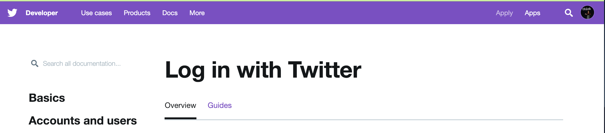
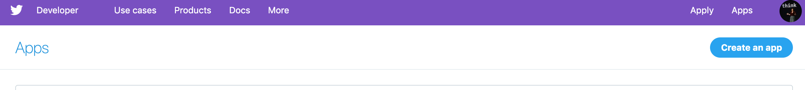
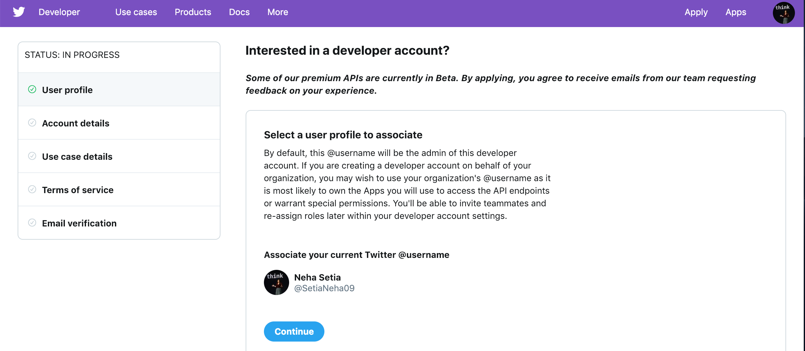
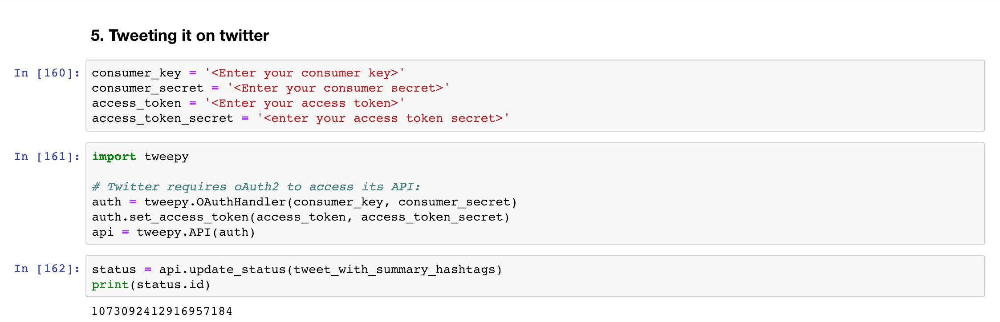
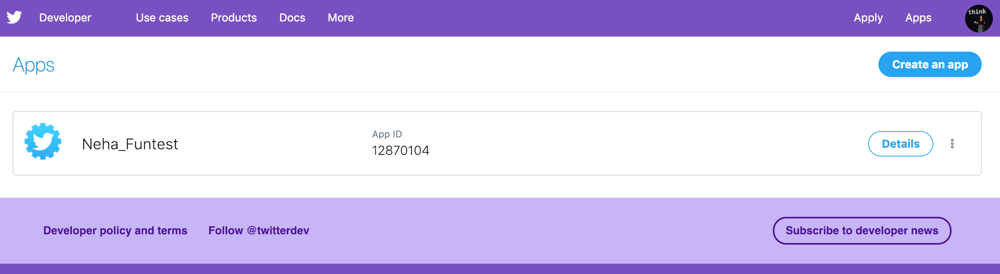

# Text summarization of a Travel blog and tweeting it to increase the reach and expand business.
Twitter’s Value for Marketing is not hidden from all of us. Twitter is like the “Swiss Army knife” of social media. Like the classic penknife, which contains a multifaceted toolset designed to serve a variety of functions, you can use Twitter for multiple purposes, depending on your business goals and needs. However, growing your Twitter account and turning it into an actual tool that generates leads and builds up your brand. Growing a real following on Twitter takes more than sending out Tweets whenever your company has a product being released or an upcoming event. It’s about engaging with your target audience and interacting with them. Hashtags are so darn important in doing so. A hashtag is a label used on social media sites that makes it easier to find information with a theme or specific content. Associations can use hashtags to reach their target audience and to help members filter information.

Successful Twitter marketing is powerful. You can unlock new opportunities to grow your business online. If Twitter is used well, it can drive tons of traffic to your website. But you need to be creative when crafting tweets to promote your blog posts, videos, and other content. 

In this Code Pattern We will demonstrate a methodology to summarize a blog using Watson Studio. We will make use of the existing Code Pattern [Text summarization and visualization using watson studio](https://github.com/IBM/text-summarization-and-visualization-using-watson-studio). You will get the details of the text summarization from the suggested code pattern. This Code Pattern focuses on extractive summarization of the travel blog, extracting keywords converting them into relevant hashtags and tweeting it on twitter. 

For the sake of an example to show how one can market and grow their business, we have taken an upcoming famous website [hostelgeeks.com](https://hostelgeeks.com/short-travel-stories/) where they share stories of the people who have travelled or visited the places listed in their travel blogs. Humans are fond of stories. Since childhood they have lots of memories to share which makes them happy. Sharing their experience with other people does two things. First any travel blog gives awareness to the travellers and also incites the desire to visit and have that experience too. Second it reviews and comments about any place from a credible source also decides the credibilty of that place which all the travellers look for before investing in any travel plans. So we ran text Summarization on the stories, converted them into meaningful impactful tweet and tweeted it using twitter API with relevant Hashtags.

[A Brief about Text Summarization](https://machinelearningmastery.com/gentle-introduction-text-summarization)

When the reader has completed this code pattern, they will understand how to:

* Quickly summarize the text from documents & news feeds.
* Create topic modeling on the text to extract important topics.
* Create visualizations for better understanding of the data.
* Interpret the summary and visualization of the data.
* Tweet it on twitter.

# Architecture Diagram


1.  User logs into Watson Studio, creates an instance which includes object storage.
2.  User uploads the data file to the object storage.
3.  User imports a Jupyter Notebook from the URL.
4.  User runs the processing techniques & creates a statistical model for topics in the notebook.
5.  User explores the visualization in the notebook and can export the output to object storage.

## Included components

* [IBM Watson Studio](https://www.ibm.com/cloud/watson-studio): Analyze data using RStudio, Jupyter, and Python in a configured, collaborative environment that includes IBM value-adds, such as managed Spark.

* [IBM Cloud Object Storage](https://console.bluemix.net/catalog/services/cloud-object-storage): An IBM Cloud service that provides an unstructured cloud data store to build and deliver cost effective apps and services with high reliability and fast speed to market. This code pattern uses Cloud Object Storage.

* [Jupyter Notebooks](http://jupyter.org/): An open-source web application that allows you to create and share documents that contain live code, equations, visualizations and explanatory text.

## Featured technologies

* [Data Science](https://developer.ibm.com/code/technologies/data-science/): Systems and scientific methods to analyze structured and unstructured data in order to extract knowledge and insights.
* [Analytics](https://developer.ibm.com/code/technologies/analytics/): Analytics delivers the value of data for the enterprise.
* [Python](https://www.python.org/): Python is a programming language that lets you work more quickly and integrate your systems more effectively.
* [Text Ranking](https://pypi.org/project/gensim/): Gensim is a free Python library designed to automatically extract semantic topics from documents. The gensim implementation is based on the popular TextRank algorithm.
* [Word Cloud](https://pypi.org/project/wordcloud/): It is used for identifying and visualizing the key words in the document.
* [pyLDAvis](https://pypi.org/project/pyLDAvis/) : It is a Python library for interactive topic model visualization.

# Watch the Video

[](https://youtu.be/m98Jjpqi45I)


# Steps

Follow these steps to setup and run this code pattern. The steps are
described in detail below.

1. [Create an account with IBM Cloud](#1-create-an-account-with-ibm-cloud)
1. [Create a new Watson Studio project](#2-create-a-new-watson-studio-project)
1. [Create the notebook](#3-create-the-notebook)
1. [Add the data](#4-add-the-data)
1. [Insert the credentials](#5-insert-the-credentials)
1. [Run the notebook](#6-run-the-notebook)
1. [Analyze the results](#7-analyze-the-results)

## 1. Create an account with IBM Cloud

Sign up for IBM [**Cloud**](https://console.bluemix.net/). By clicking on create a free account you will get 30 days trial account.

## 2. Create a new Watson Studio project

Sign up for IBM's [Watson Studio](http://dataplatform.ibm.com/). 

Click on New project and select Data Science as per below.


Define the project by giving a Name and hit 'Create'.


By creating a project in Watson Studio a free tier ``Object Storage`` service will be created in your IBM Cloud account.

## 3. Create the notebook

* Open [IBM Watson Studio](https://dataplatform.ibm.com).
* Click on `Create notebook` to create a notebook.
* Select the `From URL` tab.
* Enter a name for the notebook.
* Optionally, enter a description for the notebook.
* Enter this Notebook URL:https://github.com/Neha-Setia/summarizingTheArticleAndTweetingIt/blob/master/notebook/Text_Summarize_and_Tweet.ipynb
* Select the runtime (1vCPU and 4GBRAM)
* Click the `Create` button.


## 4. Run the notebook

When a notebook is executed, what is actually happening is that each code cell in
the notebook is executed, in order, from top to bottom.

Each code cell is selectable and is preceded by a tag in the left margin. The tag
format is `In [x]:`. Depending on the state of the notebook, the `x` can be:

* A blank, this indicates that the cell has never been executed.
* A number, this number represents the relative order this code step was executed.
* A `*`, this indicates that the cell is currently executing.

There are several ways to execute the code cells in your notebook:

* One cell at a time.
  * Select the cell, and then press the `Play` button in the toolbar.
* Batch mode, in sequential order.
  * From the `Cell` menu bar, there are several options available. For example, you
    can `Run All` cells in your notebook, or you can `Run All Below`, that will
    start executing from the first cell under the currently selected cell, and then
    continue executing all cells that follow.


## 5. Get access tokens and consumer key to use Twitter Api.
* Go to `https://developer.twitter.com/` and sign in using twitter login ID. If you don't have login credentials, then sign up.
* Click on Apps(top right of the navigation bar)


* Click on create an app button.


* Follow the process, answer the questions and it should create your app.


* Click on the details button and then click on `Keys and Tokens` and get the access tokens and consumer keys.




## 6. Analyze the results

Lets look at the summarization of the document. We can observe that all the key pointers are included in the summary. The text ranking algorithm has produced good results. 

`I dislike entering book shops. Every time I walk into a book shop, I will end up buying one. I entered an international bookshop in Eixample, Barcelona, while looking for some cool things to do in Barcelona. And as expected, a book named „The dead alleys of Barcelona“ got my attention, a crime novel. Long story shot: I bought it, went home, and started reading. In this book, the author Stefanie Kremser talks about a special part of El Born, downtown Barcelona. She describes this magical square, this narrow street the main character lived in. I didn’t know this exact street, and I was curious. I went downtown, wandered around the square and saw this café with the few tables on the terrace. Until today, 7 years later, it is still my favorite café in Barcelona – thanks to this book! – – – This Short Travel Story was written by Matt, the guy behind Hostelgeeks. Here at Hostelgeeks we award and collect 5 Star Hostels around the world. Fancy more coffee? Find the 13 best coffee shops in Barcelona here. Barcelona is our home. You can find our best-kept secret tips for Barcelona as well as 23 fun things to do. It also includes our favorite Café in Barcelona. Our hottest tip for Barcelona? Rent a Red Vespa (www.via-vespa.com) to get around easily.  Your email address will not be published.`

As we can see in the below image, the important words in the corpus have been highlighted which will help in inference of the data. Wordclouds are beautifully insightful with pros and cons. Word clouds can allow you to share back results from research in a way that does not require an understanding of the technicalities. Some of the pros are below.
* It reveals the essential. 
* They delight and provide emotional connection. 
* They are fast & engaging. 
As observed, skilled interpretation is what provides the beautiful insights. 


Latent Dirichlet Allocation (LDA) is a probabilistic model with interpretable topics. Topic modeling is one of the most popular NLP techniques with several real-world applications such as dimensionality reduction, text summarization, recommendation engine, etc. To visualize our topics in a 2-dimensional space we will use the pyLDAvis library. This visualization is interactive in nature and displays topics along with the most relevant words.

on the running the cell with command 
``` status = api.update_status(tweet_with_summary_hashtags)
print(status.id) 
```

you will get a code which indicates the tweet with hashtags has been tweeted.


# Troubleshooting

[See DEBUGGING.md.](DEBUGGING.md)

# License

This code pattern is licensed under the Apache Software License, Version 2.  Separate third party code objects invoked within this code pattern are licensed by their respective providers pursuant to their own separate licenses. Contributions are subject to the Developer [Certificate of Origin, Version 1.1 (DCO)] (https://developercertificate.org/) and the [Apache Software License, Version 2] (http://www.apache.org/licenses/LICENSE-2.0.txt).

ASL FAQ link: http://www.apache.org/foundation/license-faq.html#WhatDoesItMEAN
